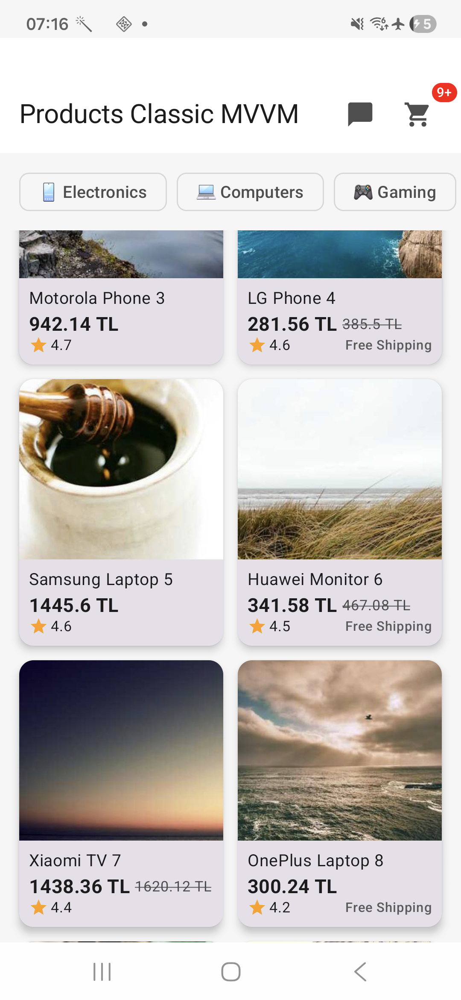
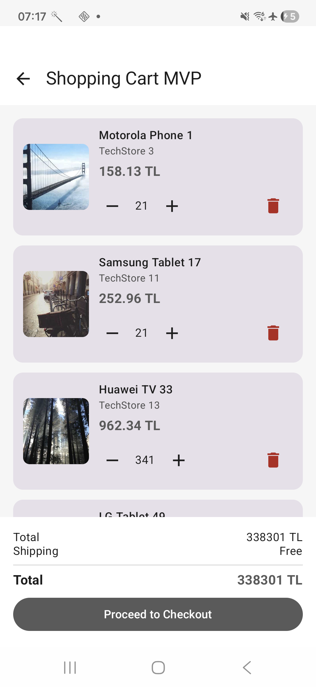
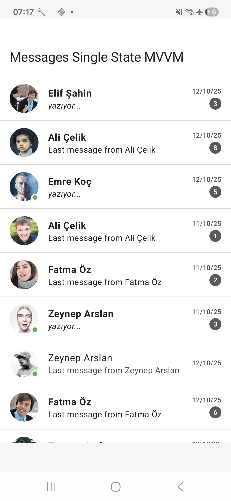

# BaseArchitecture: Android Architecture Patterns Benchmark Study

A comprehensive research project comparing 6 Android architecture patterns (including HYBRID) implemented with Jetpack Compose using **Clean Architecture** principles and the **API/Impl separation technique**. The project includes performance benchmarks, static code analysis, energy consumption analysis, and architectural evaluations. Data is primarily served from mock JSON files, with only images being fetched from API endpoints.

## 📋 Overview

This project implements the same three features (Cart, Chat, Product List) using **6 different Android architecture patterns**:
- **Classic MVVM** (ViewModel + StateFlow)
- **MVC** (Model-View-Controller)
- **MVP** (Model-View-Presenter)
- **Single-State MVVM** (Custom State Pattern)
- **MVI** (Model-View-Intent)
- **HYBRID** (Product: Classic MVVM, Cart: MVP, Chat: Single-State MVVM)

Each implementation features nearly identical UI and business logic, allowing for fair performance and code quality comparisons. The project follows **Clean Architecture** principles with clear separation between domain, data, and presentation layers. The **API/Impl separation technique** is used throughout, allowing for easy swapping between implementations (e.g., mock vs. real implementations).

### Data Sources

- **Mock Data**: All business data (products, cart items, chat messages, user profiles) are served from local JSON files located in the `src/mock/resources/` directories of each feature module.
- **API Data**: Only images are fetched from remote API endpoints. All other data is mock-based to ensure consistent benchmarking conditions.

## 🏗️ Project Structure

### Core Architecture

The project uses a modular **Clean Architecture** with clear separation of concerns, implementing the **API/Impl pattern** for all core and feature modules:

```
BaseArchitecture/
├── core/                          # Shared core modules
│   ├── designsystem/              # UI components & theme
│   ├── model/                     # Data models
│   ├── navigation/                # Navigation setup
│   ├── ui-api/                    # UI interfaces
│   ├── ui-impl/                   # UI implementations
│   ├── network-api/               # Network interfaces
│   ├── network-impl/              # Network implementations
│   ├── analytics-api/             # Analytics interfaces
│   ├── analytics-impl/            # Analytics implementations
│   ├── database-api/              # Database interfaces
│   ├── database-impl/             # Database implementations
│   ├── datastore-api/             # DataStore interfaces
│   ├── datastore-impl/            # DataStore implementations
│   ├── notification-api/          # Notification interfaces
│   └── notification-impl/         # Notification implementations
│
├── feature/                       # Feature modules
│   ├── cart-impl/                 # Default Cart (Single-State MVVM)
│   ├── cart-impl-classicmvvm/     # Classic MVVM Cart
│   ├── cart-impl-mvc/             # MVC Cart
│   ├── cart-impl-mvp/             # MVP Cart
│   ├── cart-impl-mvi/             # MVI Cart
│   │
│   ├── product-impl/              # Default Product (Single-State MVVM)
│   ├── product-impl-classicmvvm/  # Classic MVVM Product
│   ├── product-impl-mvc/          # MVC Product
│   ├── product-impl-mvp/          # MVP Product
│   └── product-impl-mvi/          # MVI Product
│   │
│   ├── chat-impl/                 # Default Chat (Single-State MVVM)
│   ├── chat-impl-classicmvvm/     # Classic MVVM Chat
│   ├── chat-impl-mvc/             # MVC Chat
│   ├── chat-impl-mvp/             # MVP Chat
│   └── chat-impl-mvi/             # MVI Chat
│
└── benchmark/                     # MacroBenchmark tests
```

### Technology Stack

- **Language**: Kotlin 2.1.10
- **UI Framework**: Jetpack Compose
- **Architecture**: 5 patterns (MVVM, MVC, MVP, Single-State MVVM, MVI)
- **Dependency Injection**: Hilt
- **Async**: Kotlin Coroutines + Flow
- **Build**: Gradle 8.x with Version Catalog
- **Min SDK**: 21
- **Target SDK**: 36
- **Java Version**: 11

## 🎯 Three Implemented Features

### 1. Cart Feature
Shopping cart management with:
- Add/remove items
- Quantity updates
- Multi-step checkout flow
- Address selection
- Payment method selection

### 2. Chat Feature
Real-time messaging with:
- Chat list with latest messages
- Chat detail with message history
- Real-time message streaming
- Send/receive messages

### 3. Product List Feature
E-commerce product browsing with:
- Product list with grid view
- Category filtering
- Pagination
- Product details

## 🚀 Getting Started

### Prerequisites

- Android Studio Hedgehog (2024.1.1) or later
- JDK 11 or higher
- Android SDK 35
- Gradle 8.x

### ⚙️ Architecture Configuration

**Important**: Only **one architecture pattern** can be active at a time. To test a specific architecture, you must configure the `app/build.gradle.kts` file.

#### Configuring Architecture Implementation

You can configure the architecture in two ways:

##### Option 1: Manual Configuration

In `app/build.gradle.kts`, locate the dependency section and configure it as follows. **Uncomment only the architecture you want to test** for each feature (Product, Cart, Chat), and keep the other 4 architectures commented out:

```kotlin
// Product - Select ONE architecture
//implementation(projects.feature.productImpl)              // Single-State MVVM
//implementation(projects.feature.productImplMvp)          // MVP
//implementation(projects.feature.productImplMvc)          // MVC
//implementation(projects.feature.productImplClassicmvvm)   // Classic MVVM
//implementation(projects.feature.productImplMvi)           // MVI

// Cart - Select ONE architecture
//implementation(projects.feature.cartImpl)                 // Single-State MVVM
//implementation(projects.feature.cartImplMvp)               // MVP
//implementation(projects.feature.cartImplMvc)              // MVC
//implementation(projects.feature.cartImplClassicmvvm)      // Classic MVVM
//implementation(projects.feature.cartImplMvi)               // MVI

// Chat - Select ONE architecture
//implementation(projects.feature.chatImpl)                 // Single-State MVVM
//implementation(projects.feature.chatImplMvp)              // MVP
//implementation(projects.feature.chatImplMvc)              // MVC
//implementation(projects.feature.chatImplClassicmvvm)      // Classic MVVM
//implementation(projects.feature.chatImplMvi)               // MVI
```

**Example**: To test MVP architecture, uncomment all `*Mvp` implementations and keep others commented.

##### Option 2: Automated Script (Recommended)

Use the provided automation script to automatically configure and run benchmarks across all architectures. The script handles:
- **Automatic BuildConfig updates** in both `app` and `benchmark` modules
- **Automatic dependency management** in `app/build.gradle.kts`
- **State management** to resume from failures
- **Connection monitoring** for WiFi ADB (energy mode)

**Benchmark Modes:**
- **General Mode** (default): Runs `BenchmarkTestSuite` with all benchmarks (Startup, Rendering, Interaction, Memory). Works with USB or WiFi ADB connection.
- **Energy Mode** (`--energy`): Runs only `EnergyBenchmark` tests for power consumption measurement. Requires WiFi ADB connection and device must be unplugged.

**Usage Examples:**

```bash
# Run all architectures in general mode (BenchmarkTestSuite)
./scripts/run_benchmarks.sh

# Run all architectures in energy mode (EnergyBenchmark only)
./scripts/run_benchmarks.sh --energy

# Run single architecture in general mode
./scripts/run_benchmarks.sh -a mvi

# Run single architecture in energy mode
./scripts/run_benchmarks.sh --energy -a mvi

# Clean start (delete previous results and state)
./scripts/run_benchmarks.sh -c

# Clean start with energy mode
./scripts/run_benchmarks.sh --energy -c
```

**Script Features:**
- Automatically iterates through all 5 architectures (classicmvvm, singlestatemvvm, mvc, mvp, mvi)
- Updates BuildConfig and dependencies for each architecture
- Builds and runs benchmarks with retry logic (up to 3 retries)
- Includes cooldown periods: 2 minutes between retries, 5 minutes between architectures
- Manages state to resume from failures
- Monitors ADB connection (WiFi ADB monitoring for energy mode only)

For detailed script documentation, see [`scripts/README.md`](scripts/README.md).

### Build

```bash
# Clone the repository
git clone https://github.com/yfy/android-architecture-benchmarks

# Build the project
./gradlew assembleDebug

# Run benchmarks (see Benchmark section below)
./gradlew :benchmark:connectedCheck
```

### 📊 Running Benchmarks

Benchmarks are configured to run using `BenchmarkTestSuite` class. **All modules must use the `mockRelease` build variant** for accurate benchmarking.

#### Using the Automation Script (Recommended)

The easiest way to run benchmarks across all architectures is using the automation script:

```bash
# General mode - runs BenchmarkTestSuite (all benchmarks)
./scripts/run_benchmarks.sh

# Energy mode - runs only EnergyBenchmark (requires WiFi ADB, device unplugged)
./scripts/run_benchmarks.sh --energy
```

The script automatically handles architecture configuration, building, and running benchmarks. See [Architecture Configuration](#-architecture-configuration) section above for more details.

#### Manual Execution

If you prefer to run benchmarks manually:

1. **Select Architecture**: Configure `app/build.gradle.kts` as described in the [Architecture Configuration](#-architecture-configuration) section
2. **Select Build Variant**: Ensure `mockRelease` is selected for all modules (especially the `app` module)
3. **Run Benchmarks**: Execute `BenchmarkTestSuite` using Android Studio's test runner or via Gradle:

```bash
# Run all benchmarks
./gradlew :benchmark:connectedCheck

# Or run specific benchmark test
./gradlew :benchmark:connectedCheck --tests "BenchmarkTestSuite"
```

**Note**: Make sure your device or emulator is connected and unlocked before running benchmarks.

### Run Static Analysis

```bash
# Run Detekt
./gradlew detekt

# Run Lint
./gradlew lint

# SonarQube analysis (requires local SonarQube server configuration)
# Configure SonarQube in sonar-project.properties and run:
# ./gradlew sonar
```

## 📁 Key Documentation

### Raw Data

Raw benchmark data is organized into two categories:

#### Performance Benchmarks (`rawdata/performance/`)

Contains unprocessed raw benchmark results in JSON format for each architecture:
- `classicmvvm_result.json`
- `mvc_result.json`
- `mvp_result.json`
- `mvi_result.json`
- `singlestatemvvm_result.json`
- `hybrid_result.json`

#### Energy Benchmarks (`rawdata/energy/`)

Contains raw energy consumption measurements for each architecture:
- Architecture-specific folders (e.g., `mvc/`, `mvi/`, `mvp/`, etc.)
- Detailed CSV files per scenario (Chat_Streaming, Shopping_Cart, Product_Browsing)
- Energy consumption summary files (CSV and JSON)
- README files with test metadata

### Processed Data

#### Comprehensive Analysis Results (`analysis_result/`)

Complete statistical analysis results for all architectures. Detailed JSON files contain all raw analysis data including statistical tests, rankings, and scores.

**6 Architectures (Including HYBRID):**

| Architecture | Performance Score | Performance Rank | Memory Score | Memory Rank | Code Quality Score | Code Quality Rank | Energy (mWh) | Energy Rank |
|--------------|-------------------|-----------------|--------------|-------------|-------------------|-------------------|--------------|-------------|
| HYBRID | 88.00 | 1 | 73.54 | 2 | N/A | - | 60.54 | 1 |
| MVP | 81.33 | 2 | 62.50 | 4 | 62.50 | 2 | 60.71 | 2 |
| Classic MVVM | 68.67 | 3 | 68.23 | 3 | 37.46 | 4 | 76.45 | 3 |
| Single-State MVVM | 65.33 | 4 | 22.02 | 6 | 41.35 | 3 | 82.31 | 6 |
| MVI | 59.33 | 5 | 59.18 | 5 | 34.27 | 5 | 79.40 | 4 |
| MVC | 57.33 | 6 | 78.40 | 1 | 76.77 | 1 | 81.84 | 5 |

**5 Architectures (Pure Patterns):**

| Architecture | Performance Score | Performance Rank | Memory Score | Memory Rank | Code Quality Score | Code Quality Rank |
|--------------|-------------------|-----------------|--------------|-------------|-------------------|-------------------|
| MVP | 70.67 | 1 | 63.91 | 3 | 62.50 | 2 |
| Classic MVVM | 63.33 | 2 | 76.72 | 2 | 37.46 | 4 |
| Single-State MVVM | 58.67 | 3 | 33.33 | 5 | 41.35 | 3 |
| MVI | 55.33 | 4 | 59.18 | 4 | 34.27 | 5 |
| MVC | 52.00 | 5 | 87.99 | 1 | 76.77 | 1 |

## 📱 App Screenshots

### Product List Screen (Classic MVVM)


### Shopping Cart Screen (MVP)


### Messages Screen (Single-State MVVM)


## 🤝 Contributing

This is a research project for thesis purposes. Contributions and feedback are welcome through issues or pull requests.

## 📄 License

This project is licensed under the MIT License - see the LICENSE file for details.

## 👨‍💻 Author

Yusuf Furkan Yılmaz - Master Thesis Research Project

## 🔗 References

- [Android Jetpack Compose](https://developer.android.com/jetpack/compose)
- [Hilt Dependency Injection](https://dagger.dev/hilt/)
- [MacroBenchmark](https://developer.android.com/topic/performance/benchmarking/benchmarking-in-app)
- [Detekt Static Analysis](https://detekt.github.io/detekt/)

---

**Note**: This project is part of a university thesis research project on Android architecture patterns and their impact on code quality and performance.
