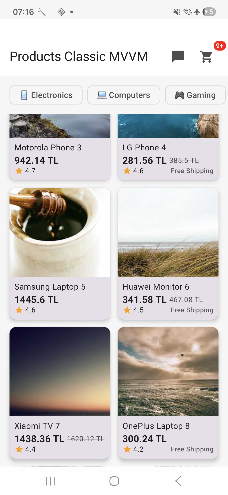
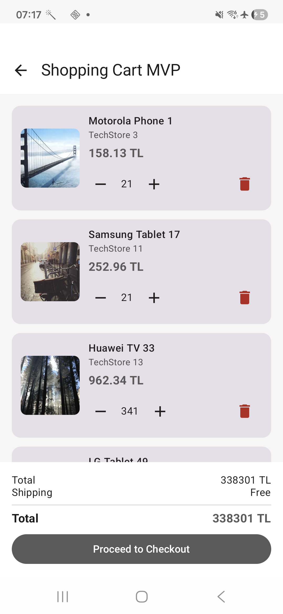

# An Empirical Evaluation of Android Architecture Patterns Under Compose-Based Workloads

Reproducibility artifact for the PeerJ Computer Science manuscript of the same title.

**Authors:** Yusuf Furkan Yılmaz and Çağrı Şahin  
**Institution:** Gazi University, Department of Computer Engineering

---

## Scope Note

This repository is the supplementary data package for the PeerJ submission. It covers **five Android architecture patterns** (Classic MVVM, Single-State MVVM, MVI, MVP, MVC) plus one **workload-aware Hybrid configuration**, evaluated across four research dimensions: runtime performance, memory behaviour, static code quality, and scenario-specific/module-specific architectural behaviour including the Hybrid configuration.

---

## Description

The study implements the same three e-commerce features — Product List, Shopping Cart, and Chat — using six Android architecture configurations in a single shared codebase. Each configuration activates a different set of feature modules at build time while sharing all core infrastructure. Data is served from local mock JSON files; only product images are fetched remotely, ensuring reproducible, network-independent benchmark conditions.

The evaluation addresses four research questions:

1. How do architecture patterns differ in runtime performance (startup time, frame rendering, jank rate) under Compose-based workloads?
2. How do they differ in memory behaviour under sustained execution across realistic usage stages?
3. What are the trade-offs in static code quality (complexity, maintainability, technical debt)?
4. How do scenario-specific and module-specific architectural behaviours manifest, and what does a workload-aware Hybrid configuration reveal about combining patterns at the module level?

---

## Dataset Information

### Raw data (`rawdata/`)

All raw benchmark outputs are in `rawdata/performance/`. Each JSON file contains three embedded data types for one architecture:

| File | Architecture |
|------|-------------|
| `rawdata/performance/classicmvvm_result.json` | Classic MVVM |
| `rawdata/performance/singlestatemvvm_result.json` | Single-State MVVM |
| `rawdata/performance/mvi_result.json` | MVI |
| `rawdata/performance/mvp_result.json` | MVP |
| `rawdata/performance/mvc_result.json` | MVC |
| `rawdata/performance/hybrid_result.json` | Hybrid |
| `rawdata/performance/runs_detail.json` | Per-run aggregated metrics (all architectures) |

Each `*_result.json` contains:
- **`benchmarks`** — 15 Jetpack Macrobenchmark scenarios (timing and frame metrics)
- **`memoryBenchmarkResult`** — PSS/heap snapshots across 10 application states
- **`staticCodeAnalysis`** — SonarQube 9.9-derived metrics (SLOC, complexity, technical debt)

See [`rawdata/README.md`](rawdata/README.md) for the full JSON schema and a benchmark-name-to-table mapping.

### Processed analysis outputs (`analysis_result/`)

| File | Manuscript table(s) |
|------|---------------------|
| `analysis_result/performance/benchmarks.csv` | Tables 1, 2, 3, 4 |
| `analysis_result/performance/memory.csv` | Table 5 |
| `analysis_result/performance/memory_phases.csv` | Table 6 |
| `analysis_result/performance/static.csv` | Tables 7, 8 |
| `analysis_result/performance/statistical_tests.csv` | Statistical analysis section |
| `analysis_result/comprehensive_analysis.json` | Table 9 |
| `analysis_result/comprehensive_analysis_6arch.json` | Discussion (6-arch scoring context; Table 10 raw metrics come from `hybrid_result.json`) |
| `analysis_result/summary_5_architectures.csv` | Table 9 |
| `analysis_result/summary_6_architectures.csv` | Discussion (6-arch dimension scores; not a manuscript table) |

See [`analysis_result/README.md`](analysis_result/README.md) for column-level documentation and notes on known naming inconsistencies.

---

## Code Information

### Repository layout

```
android-architecture-benchmarks/
├── app/                    Entry point — selects active architecture via build config
├── feature/                Feature modules (one per architecture per feature)
│   ├── cart-impl/          Single-State MVVM (default)
│   ├── cart-impl-classicmvvm/
│   ├── cart-impl-mvc/
│   ├── cart-impl-mvp/
│   ├── cart-impl-mvi/
│   ├── product-impl/       (same pattern)
│   └── chat-impl/          (same pattern)
├── core/                   Shared modules (network, database, DI, navigation, UI)
├── benchmark/              Jetpack Macrobenchmark test suite
├── scripts/                Automation scripts for benchmark runs
├── rawdata/                Raw benchmark outputs (manuscript scope)
├── analysis_result/        Processed statistical outputs (manuscript scope)
├── future_work/            Energy data — not in manuscript (see note above)
└── docs/screenshots/       App UI screenshots
```

### Architecture switching

Only one architecture is active at a time. The architecture is selected by editing `app/build.gradle.kts` to enable the correct feature module dependencies, or by using the automation script:

```bash
# Run all architectures sequentially (general benchmark mode)
./scripts/run_benchmarks.sh

# Run a single architecture
./scripts/run_benchmarks.sh -a mvi
```

See [`scripts/README.md`](scripts/README.md) for full script documentation.

### Technology stack

| Component | Version |
|-----------|---------|
| Language | Kotlin 2.1.10 |
| UI Framework | Jetpack Compose |
| DI | Hilt |
| Async | Kotlin Coroutines + Flow |
| Build | Gradle 8.x with Version Catalog |
| Min SDK | 21 |
| Target SDK | 35 |

---

## Requirements

### To inspect or reproduce the analysis

- Python 3.8+ with `pandas`, `scipy`, `numpy` (for the analysis scripts in `scripts/`)
- SonarQube 9.9 (Community Edition) for static code analysis

### To re-run benchmarks

- Android Studio Hedgehog (2024.1.1) or later
- JDK 11+
- Android SDK 35 / Gradle 8.x
- A physical Android device (emulators are not supported by Jetpack Macrobenchmark)
- `adb` and `jq` installed and on `PATH`

---

## Usage Instructions

### 1. Inspect existing results

The processed CSV files in `analysis_result/performance/` are the most direct entry point:

```bash
# View benchmark summary
cat analysis_result/performance/benchmarks.csv | head -5

# View memory overview
cat analysis_result/performance/memory.csv

# View multi-dimensional scores
cat analysis_result/summary_5_architectures.csv
```

### 2. Re-run the statistical analysis

```bash
# Comprehensive analysis for 5 architectures (Tables 1–9)
python3 scripts/comprehensive_analysis.py

# Analysis including Hybrid (Table 10)
python3 scripts/comprehensive_analysis_6arch.py

# Multi-dimensional scoring with Hybrid
python3 scripts/calculate_scores_with_hybrid.py
```

### 3. Re-run benchmarks from scratch

```bash
# Clone and open in Android Studio
git clone https://github.com/yfy/android-architecture-benchmarks

# Run all architectures (requires connected physical device)
./scripts/run_benchmarks.sh

# Run a single architecture dry-run to verify setup
./scripts/run_benchmarks.sh -d -a mvc
```

The script automatically updates `app/build.gradle.kts`, builds the `mockRelease` variant, deploys to the device, and collects Macrobenchmark JSON output.

### 4. Re-run static code analysis

```bash
# Configure SonarQube server URL in sonar-project.properties, then:
./gradlew sonar

# Extract metrics from SonarQube web API (see scripts/analyze_code_metrics.gradle.kts)
./gradlew -f scripts/analyze_code_metrics.gradle.kts analyzeCodeMetrics
```

---

## Methodology

The study follows an 8-step protocol:

1. **Architecture implementations** — Five pure patterns (Classic MVVM, Single-State MVVM, MVI, MVP, MVC) plus one Hybrid (Product: Classic MVVM, Cart: MVP, Chat: Single-State MVVM), all implemented with identical UI and business logic, varying only in presentation-layer design.

2. **Benchmark design** — 16 Jetpack Macrobenchmark scenarios grouped into four categories: startup (2), frame rendering (7), jank (3), and interaction timing (4). Each scenario runs 15 warm-up iterations followed by 15 measurement iterations on a Samsung physical device under `mockRelease` build variant.

3. **Memory profiling** — `meminfo` snapshots via ADB at 10 predefined application states, capturing Total PSS, Private Dirty, Native Heap, and Dalvik Heap per state.

4. **Static code analysis** — SonarQube 9.9 (Community Edition) analyses each architecture's three feature modules (Cart, Chat, Product). Metrics: SLOC, cyclomatic complexity, cognitive complexity, technical debt (hours), code smells. Hybrid is excluded from code quality analysis because it reuses the five pure-architecture modules unchanged.

5. **Statistical analysis** — Friedman test for overall significance; Nemenyi post-hoc pairwise comparison; Cliff's delta for effect size. Coefficient of variation (CV%) used as a stability indicator.

6. **Multi-dimensional scoring** — Each architecture receives normalised scores (0–100) in three dimensions. Scores are combined into a weighted composite for Table 9. Scoring scripts: `scripts/comprehensive_analysis.py` and `scripts/calculate_scores_with_hybrid.py`.

7. **Hybrid configuration evaluation** — The Hybrid is benchmarked with the same 16 scenarios and 10 memory states as the pure architectures (Table 10). No separate code quality score is computed.

8. **Reproducibility controls** — Device temperature monitoring between runs; 5-minute cooldown between architecture runs; 2-minute cooldown between retries; all network data served from local mock JSON to eliminate variance from API latency.

---

## App Screenshots

### Product List (Classic MVVM)


### Shopping Cart (MVP)


### Chat Messaging (Single-State MVVM)


---

## Citation

If you use this dataset or code in your research, please cite:

```
Yılmaz, Y. F., & Şahin, Ç. (under review). An Empirical Evaluation of Android
Architecture Patterns Under Compose-Based Workloads. PeerJ Computer Science.
DOI: to be assigned upon acceptance.
```

---

## References

- [Jetpack Macrobenchmark](https://developer.android.com/topic/performance/benchmarking/benchmarking-in-app)
- [Jetpack Compose](https://developer.android.com/jetpack/compose)
- [SonarQube 9.9 LTS](https://www.sonarsource.com/products/sonarqube/)
- [Hilt Dependency Injection](https://dagger.dev/hilt/)
- [Kotlin Coroutines](https://kotlinlang.org/docs/coroutines-overview.html)

---

## License

MIT License — see [LICENSE](LICENSE) for details.

---

## Authors

**Yusuf Furkan Yılmaz** and **Çağrı Şahin**  
Department of Computer Engineering, Gazi University, Ankara, Turkey

---

## Contributing

This is a research reproducibility repository associated with a peer-reviewed manuscript. Bug reports and questions about reproducibility are welcome via GitHub Issues. Pull requests that correct errors in the data or analysis scripts will be considered; changes to the Android source code are out of scope.
